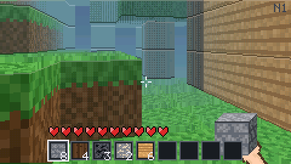
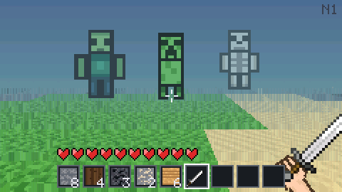
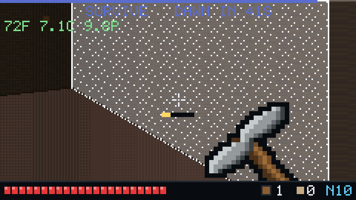
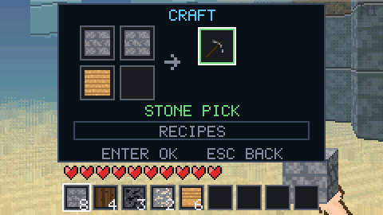
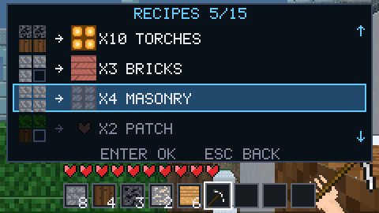
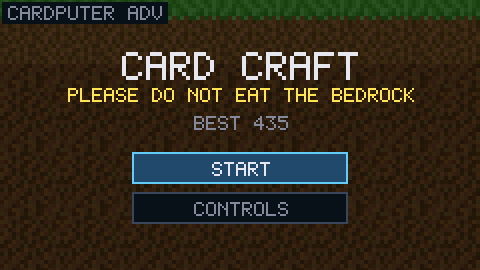

<h1 align="center">Card Craft</h1>

<p align="center"><b>Mine by day. Wall yourself in by night. Survive.</b></p>

<p align="center">
  
  
</p>

<p align="center"></p>

A first-person survival game that runs on the thing in your pocket. Dig up a
world made of blocks, build something to hide in, and see how many nights you
last.

## What you do

**Mine.** Every block can come out, and every block goes back somewhere else.
Dig into a hillside and the rest of it stays up. Cut a tunnel, lay a floor in
mid-air, take the roof off a ruin.

**Build.** Two blocks high is over your head, so a wall is a wall. That is the
whole plan for most of your first night.

**Craft.** Recipes are shapes. A pickaxe is a wide head over a handle, a sword
is a blade over a handle, a torch is coal over wood. Start with nothing, chop a
tree, and work up through stone, iron and diamond.

**Survive.** At dusk the mobs come. Zombies wind up before they swing, so you
can see it and step back. Skeletons shoot from far away. Creepers blow a hole
in whatever you just built. Torches keep the ground around them clear.

Your score is nights survived. It is saved on the device.

<p align="center">
  
  
</p>
<p align="center"><i>A sword answers them in daylight. At night you mostly hear them first.</i></p>

<p align="center">
  
  
</p>
<p align="center"><i>Lay a recipe out yourself, or pick it from the book.</i></p>

<p align="center"></p>

## Controls

Right hand moves, left hand acts.

| | Key |
|---|---|
| Move, turn | arrows |
| Mine, attack | `W` — hold it |
| Build | `A` |
| Look up, down | `E` `S` |
| Centre the view | `ENTER` |
| Jump | `SPACE` |
| Pick a block | `1`–`9` |
| Drop | `Q` |
| Craft | `TAB` |
| Confirm, back | `ENTER`, `ESC` |

There is a **CONTROLS** card in the game as well, on the title screen and in
the pause menu.

## Install

You need a [M5Stack Cardputer](https://shop.m5stack.com/products/m5stack-cardputer-kit-w-m5stamps3)
and [PlatformIO](https://platformio.org/install).

```sh
git clone https://github.com/therezor/card-craft
cd card-craft
pio run -e cardputer -t upload
```

One build runs on both the Cardputer and the Cardputer ADV.

<p align="center">MIT · made by <b>REZOR</b> · <a href="https://rezor.me">rezor.me</a></p>
