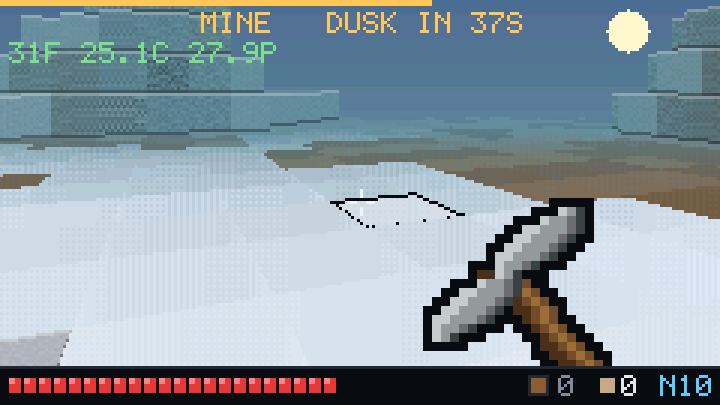

<h1 align="center">Card Craft</h1>

<p align="center"><b>Mine by day. Wall yourself in by night. Survive.</b></p>

<p align="center">
  
  
  
  
</p>

<p align="center">
  
  
  
</p>

## The problem

A Minecraft clone on a microcontroller is usually a tech demo: a voxel renderer
that draws a world and stops there. It runs at fifteen frames a second, it has
no reason to be played twice, and the "game" is a block editor with no stakes.

The ESP32-S3 in a Cardputer has 240 MHz, no PSRAM, a 240x135 panel and about
320 KB of usable RAM. The panel is the hard limit: a full frame is 64,800 bytes
and the SPI bus runs at 40 MHz, so a frame takes **12.96 ms to transmit** no
matter what is in it. That is a hard ceiling of 77 fps, and it leaves roughly
13 ms of CPU per frame — but only if the CPU work overlaps the transfer.

## The solution

A first-person survival game with a real loop, running at **32 fps worst case
and 48 fps average**, measured on-device against a full twenty-four-mob wave.

**The loop.** Daylight is a countdown. You mine to gather blocks to build with
and ore to upgrade with, but ore only exists underground and in the open pits,
which are the last places you want to be at dusk. At night, mobs spawn at the
map edges and walk to you. Zombies press: every blow is announced by a wind-up
pose and can be walked out of, which is the difference between a fair fight and
an unreadable one. Creepers detonate and blow a hole in whatever you built,
which is what stops walling yourself in from being a solved strategy. Skeletons outrange you from night four. Survive to dawn and you spend
your ore on one of three upgrades. Score is nights survived; it persists to NVS.

**The world** is a 96x96 grid of one-metre cubes, eight blocks deep and
twenty-four tall over a bedrock plane. A column is a **32-bit occupancy mask**,
one bit a block — the world is exactly 32 tall, so a column is exactly one word.
Any block anywhere can be taken out or put back: mine into the side of a hill
and the rest of it stays up as a tunnel, build out from a ledge and you get a
floor you can stand on, and a column can have as many holes in it as it has
blocks. There is no cap and so no refusal. Terrain is
two octaves of value noise, and on top of it go shapes noise cannot make: trees
with real canopies, walled ruins you can shelter in, and open quarries cut past
the stone line where ore shows on the surface.

**Materials under the surface are computed, not stored.** A column remembers the
height the generator left it at; grass over dirt over stone over ore falls out of
the depth below that number. It costs one byte a cell and it cannot drift out of
step with the terrain. Everything the profile cannot derive — a trunk, a canopy,
a wall, anything a player placed — is a short list of **markers**, each saying
"from this z upward, the material is m".

Geometry and material are kept apart deliberately, and it is what makes the
world's one hard rule work: **removing a block cannot change what anything is
made of, so mining allocates nothing and can never be refused.**

**The renderer** is a raycaster. A ray does not stop at the first solid cell —
it keeps stepping outward, and each cell contributes the side of every run of
solid blocks it carries, plus each run's top and underside. The runs come off
the occupancy mask with a bit scan, and a run of like blocks is **one span, not
one per block**: a six-high stone wall costs the clipper a single call where it
used to cost six, and the bevels that separate the blocks inside it are ruled
afterwards from the texture coordinate. Occlusion is a list of still-unpainted row ranges
rather than a single high-water mark, because the moment a world can have an
overhang the painted region of a column stops being one contiguous run.

**Blocks are textured** from a 16x16 tile per material, and it costs about half
a millisecond a frame. The trick is that a texel is an index rather than a
colour: it picks one of eight authored colours, and the shade table that already
existed runs all eight through the same distance, torch and daylight shading it
used to run one through. The inner loop is the same two loads it was when the
last axis meant "one of four brightness steps".

## Controls

Four buttons is the entire input budget, so the game can be ported to boards
with no keyboard. The crosshair sits at the centre of the panel, where the aim
ray actually lands, at any pitch. Looking up and down is outside that four-button
core on purpose: a board with no keys to spare leaves the camera at the fixed
downward tilt the game shipped with and plays exactly as it always did.

The layout is two-handed: the right hand lives on the arrow cluster and does
all the moving and all the menu navigation, the left hand lives on `E` and `D`
and does all the acting. No key means two things, which is why `WASD` is not
also bound to movement — `D` has to mean build.

| Action | Cardputer | Hand |
|---|---|---|
| Move, back | `;` `.` (up/down arrows) | right |
| Turn | `,` `/` (left/right arrows) | right |
| Mine, attack | `E` (or `SPACE`) — hold it; the block under the crosshair is lit and outlined | left |
| Build | `D` — places against the face you are aiming at | left |
| Cycle block | `S` — steps through the nine-slot hotbar | left |
| Craft | `W` — opens the crafting grid, and closes it again | left |
| Drop | `Q` — throws the selected item at your feet; hold to empty a stack | left |
| Look up, down | `R` `F` — about 60° each way; both together recentres | left |
| Back, menu | `ESC` (the top-left key, also `TAB`) — one level up, wherever you are | left |
| Confirm | `ENTER` (`E` also works) | left |

Mining takes the block the crosshair is on, and building puts one against the
face it is on — so aiming at the foot of a wall tunnels into it rather than
taking the block off its top, and aiming at a wall's side builds outward rather
than upward. Reach is 5.5 world units from the eye, for both.

Every card in the game is driven the same way: **arrows move, `ENTER` does the
thing, `ESC` goes up one level.** No card has a key that means one particular
thing, because a card that needs to be explained is a card the player has to be
told about while they are trying to use it.

On the crafting card that means the cursor visits six places, not four — the
four grid cells, the result slot, and a `RECIPES` row underneath. `ENTER` on a
cell cycles it through what you are actually carrying; on the result slot it
makes whatever the grid spells; on the `RECIPES` row it opens the book.

The book draws every recipe as its own ingredients — the same block icons that
are on your hotbar, in the order they go into the grid, then an arrow and what
comes out. Recipes you cannot afford are darkened rather than greyed, so you can
still see *which* material you are short of. `ENTER` lays a recipe out on the
grid and drops you back on it with the cursor already on the result slot, so
making something from the book is: find it, `ENTER`, `ENTER`.

The nine slots are a real capacity, not a display. Stacks are unbounded, but a
material with no slot to claim will not fit — and rather than vanishing into a
count you cannot see, it is **spilled on the floor** where it broke. Walk over
a dropped item to take it back; `Q` throws one out to make room. Lava eats what
falls in it, and nothing lies around for more than about ninety seconds.

A run starts with **nothing in your hands**. Wood comes away from a tree in
about four seconds by fist, three blocks at a time, and three planks make the
first pickaxe; from there the ladder is stone, iron, and diamond from the
bottom three layers of the world. Pickaxes and swords both wear out — the bar
under the icon is what is left of one — and a sword's tier is the difference
between three blows on a zombie and one.

Torches are the only light there is, and nothing on the map comes with any: no
village, no house, no castle. Mobs will not spawn on lit ground, so a torch is
the difference between a shelter and a room full of things that walked in.

The pause card carries the one setting the game has: **SOUND: ON/OFF**, kept in
NVS so it survives a reboot. It defaults to off.

Building into your own body is refused — not just the cell you stand in but the
whole volume you occupy, which is what stops pillaring straight up out of a
wave. Building into a mob is refused too.

## Performance

Measured on a Cardputer ADV with the `cardputer-dev` build, which prints frame
timings over USB and answers `b` with a scripted play session. That session
jumps straight to a late-night wave, because a benchmark that measures night one
measures five mobs and the frame rate that has to hold is the one with a full
field of twenty-four.

| | worst | mean | best |
|---|---|---|---|
| Night, full 24-mob wave | 32 fps | 48 fps | 67 fps |

CPU averages 14.9 ms against a 12.98 ms transfer, so the frame is now limited by
the processor rather than by the panel — which is the opposite of what this
section used to say, and the change is the textured floors. `world_us` alone is
11.9 ms of it.

**The benchmark is deterministic, and a fixed seed was not enough to make it so.**
It seeds from a constant, so every run measures the same island. But the
simulation was still advanced by *elapsed time*, and that quietly ruined the
comparison: a build that renders more slowly takes more catch-up ticks per
frame, walks further per frame, and a few seconds in is standing somewhere else
looking at a different scene. Render cost feeds tick rate feeds camera position
feeds render cost. Measured over forty windows, that put two runs of the **same
build** 12% apart on frame rate and 33% apart on CPU.

The bench loop runs exactly one tick per frame and ignores the clock. The walk
is then frame-indexed, window *n* is the same simulated moment in every build,
and two consecutive runs agree to within 0.3% — often to 0.0%. The game runs
slower than real time while benching, which does not matter: nothing here is
measuring how the game feels.

Block textures cost about half a millisecond a frame. `-e cardputer-notex` is
the same dev build with the sampling compiled out, so the figure can be checked
rather than asserted:

| | no textures | textures | delta |
|---|---|---|---|
| fps, mean over the scripted walk | 64.4 | 62.2 | −3.4% |
| walker, mean | 7,030 µs | 7,543 µs | +513 µs |

Texels have to live in RAM. Left in `.rodata` they are external flash behind the
instruction cache, and the wall loop reads them at a position that jumps with
the material and the ray angle — close to the worst pattern a cache can be
given. That cost 1.5 ms a frame; four kilobytes of SRAM buys all of it back.

The single largest saving was not in the renderer at all. `shadeFor` rebuilds
every material's shade table from the hour of the day, and it was doing so on
every frame — **6.4 ms, half the budget, recomputing a value that takes a hundred
seconds to cross its range.** Quantising the day into 512 steps rebuilds it
about ten times a second, which is finer than the eye can follow a sunset:

| | before | after |
|---|---|---|
| `shadeFor` | 6414 us/frame | 143 us/frame |
| frame rate | 40 fps average | 64 fps average |

Four things buy the rest:

- **Pre-swapped framebuffers.** The ST7789 wants big-endian RGB565. Typing the
  buffers as `lgfx::swap565_t` and baking the swap into the shade tables means
  `pushImageDMA` takes the `pixelcopy_t::no_convert` path and nothing in a hot
  loop ever swaps a byte.
- **A held SPI transaction.** `startWrite`/`endWrite` are reference-counted in
  LovyanGFX, so holding one open across frames stops the `endWrite` inside
  `pushImageDMA` from ending the transfer and waiting on it. This alone moved the
  frame time from 16.0 ms to 12.98 ms — the CPU work now genuinely overlaps the
  transfer instead of running after it.
- **Two buffers**, so the frame being built is never the frame being sent.
- **Both cores.** Columns are independent — each walks the world read-only and
  writes only its own pixels — so core 0 takes the even columns and core 1 the
  odd ones, with no locking and a two-notification handshake. Interleaved, not
  split down the middle: a contiguous split leaves one core staring at a cliff
  filling its whole stripe while the other looks at sky, and the frame costs
  whatever the slower half costs.

Two things that were tried and measured as losses, and are documented in the
source so they are not tried again:

- **Merging consecutive floor cells into one span** (Doom's floor casting).
  A/B on a fixed scene: 10.5 ms merged against 4.3 ms unmerged. Doom's version
  pays because it replaces per-column ray work; this replaced an already-cheap
  flat fill over the largest area of the screen with a per-row shade
  computation, and the pixels cost far more than the spans saved.
- **`-flto`.** It has to be on the link line to resolve `src/`'s objects, which
  collects the Arduino core, where it drops `app_main()` as unreferenced —
  the only caller is inside a precompiled archive the optimiser cannot see, and
  `--undefined=app_main` does not save it. The inlining it would have bought is
  got instead by **`src/unity.cpp`**, which compiles the four files in the
  frame's path as one translation unit. Same cross-module inlining, no link line
  involved, and the Arduino core never enters into it.
- **Ruling block boundaries inside the pixel loop.** A span covers a whole run
  of like blocks now, so the bevels between them fall inside it. The obvious way
  to find them is to watch the texture coordinate wrap, since it wraps exactly
  once a block — and that costs a compare and an unpredictable branch on every
  wall pixel. Measured at **+726 µs a frame against the 183 µs the merging
  saves.** The boundaries are computed arithmetically outside the loop instead.

The walker itself carries the reciprocal from each cell's far edge to the next
cell's near edge (one divide per cell, not two), steps block bands by
subtraction rather than reprojecting each one, skips a column's whole side when
even its top is already covered, and stops at 17 cells because the shade table
saturates at 16.

## Build

```sh
pio run -e cardputer -t upload          # the game
pio test -e native                      # 164 host tests, no hardware needed
pio run -e cardputer-dev -t upload      # + frame-time overlay, telemetry, screenshots
./tools/grab-screenshots.py             # pull PNGs off the dev build
./tools/make-font.py                    # regenerate src/font5x7.h from its glyph art
./tools/make-textures.py                # regenerate src/textures.h from its block art
pio run -e cardputer-notex -t upload    # the dev build with textures compiled out,
                                        #   for A/B'ing what they cost
```

One binary runs on both the Cardputer and the Cardputer ADV: they share the
StampS3 module, M5GFX autodetects the panel, and M5Cardputer picks the keyboard
controller (IO matrix or TCA8418) at runtime.

## Layout

```
src/
  main.cpp          screens, the fixed 60 Hz timestep, audio
  world.h/.cpp      PURE  the block grid as occupancy masks, material markers,
                    terrain + structures, mining and building
  raycast.h/.cpp    PURE  camera -> screen spans
  game.h/.cpp       PURE  clock, waves, flow-field pathing, combat, upgrades
  render.h/.cpp     framebuffers, shade tables, spans, billboards, the pickaxe
  unity.cpp         compiles world/raycast/game/render as one TU — see -flto
  ui.h/.cpp         HUD and the title/upgrade/death cards
  sfx.h/.cpp        cue table and the non-blocking channel sequencer
  sfxdata.h         generated by tools/make-sfx.py — the sound bank, as PCM
  textures.h        generated by tools/make-textures.py — a 16x16 palette-indexed
                    tile per material, plus a top-face tile where the top is
                    not the side (grass)
  sprites.h         generated by tools/make-sprites.py; the pickaxe is
  textures.h        generated by tools/make-textures.py — a 16x16 tile and an
                    eight-colour palette per block material
  font5x7.h         generated by tools/make-font.py
  screenshot.h/.cpp  #ifdef DEV_SERIAL
  hal/hal.h         board contract — six held buttons and four edges
  hal/hal_cardputer.cpp
test/               Unity suites for the three pure modules
```

`world`, `raycast` and `game` include no Arduino or M5GFX headers, so the
generator, the DDA and a whole night of simulation all run on the host. Time
enters the simulation as a tick count, never as `millis()`.

## Sound

Twenty-one sounds across four mixing channels — impacts, mobs, the pickaxe, the
UI — so that mining while a creeper hisses at you is two sounds rather than a
coin toss between them.

The waveforms are **rendered offline** by `tools/make-sfx.py` and stored as 8-bit
PCM in `sfxdata.h`, and the device just plays them back. They used to be
synthesised on the board out of short tables of constant-pitch tones, and that
format is where the beeps came from: it has no envelope, so nothing decays and
every impact ends by being cut off; its "noise" is a sixteen-sample cycle played
at a pitch, which is a buzz; and it cannot sweep, so an explosion is five tones
in a row instead of one long fall. Those are not tuning problems. An explosion
is noise through a filter falling from 3 kHz to 200 Hz over most of a second,
and there is no way to say that in tones.

Rendering them costs 87 KB of a 3.2 MB partition and **no RAM at all** — the
arrays live in flash and the speaker task reads them where they lie, which
matters when the two 64.8 KB DMA framebuffers are already the tightest
allocation in the program.

    ./tools/make-sfx.py                       # rewrite the bank
    afplay tools/sfx-preview/_all.wav         # audition it without flashing

The previews are the point. A sound is judged by ear, and the loop that decides
whether one is any good should not have a 70-second build and a USB cable in it.
The sounds that repeat quickly — mining, hits, swings — get their playback rate
jittered a few percent per play, so eight ticks a second is a rhythm and not a
machine gun.

## Adding a board

Board specifics live behind `src/hal/hal.h`. Nothing in `src/` outside `hal/`
includes a board library.

1. Write `src/hal/hal_<board>.cpp` wrapped in `#if defined(BOARD_<X>)`,
   implementing `begin()`, `display()`, `update()`, `buttons()`, `caps()`,
   `boardName()`, `beep()`, `voice()`, `sample()` and `silence()`.
2. Map whatever input the board has onto the eight held flags and nine edges in
   `hal::Buttons`, and name those controls in `hal::Caps` so the on-screen hints
   match the hardware. A board with four buttons maps `LEFT/RIGHT/FWD/ACT` and
   reaches `BUILD` with an `L+R` chord; a three-button board auto-walks forward.

   Everything past that core degrades to less game, never to a broken one. No
   keys for `lookUp`/`lookDown` means the fixed downward tilt the game shipped
   with, and `caps().kLook` set to `nullptr` so the title screen does not offer
   a control that is not there. A `sample()` that returns `false` falls back to
   the step tables in `sfx.cpp`, and a `voice()` that ignores its channel and
   wave and calls `beep()` loses the layering and the timbre, not the sound.
3. Add an env to `platformio.ini` with `-D BOARD_<X>`.

A different panel size is a two-line change in `raycast.h`; nothing else in the
codebase names a pixel count.

## Overhangs

Every cell may carry one **slab**: a second solid run floating above its ground
column with air in between. That is what a plain heightmap cannot express, and
it is what a roof, a bridge, a rock arch and the mouth of a cave all are. Ruins
are roofed, hillsides have tunnels bored into them, and arches span the lowland.

Making that work meant replacing the renderer's occlusion — a single "topmost
row painted so far" — with a list of still-unpainted row ranges. It has to be a
list: the moment a world can have an overhang, you can see the ground, then a
gap of sky under a bridge, then the bridge deck, and a column's painted region
is no longer one contiguous run. Almost every candidate span still takes a fast
path for the one-range case, which is what keeps it affordable.

One slab per cell rather than an arbitrary list of runs, because one covers all
four of those shapes and the occlusion cost grows with how many holes a column
can have. Slabs are terrain, not material: you walk under them, you cannot mine
them.

Mobs are clipped correctly against them: the occlusion table records ground
geometry only, so a mob under a bridge is not hidden by the deck over it, while
slabs contribute a separate band so a mob on the *far* side of one is.

**They are ordinary blocks now.** A run used to be terrain: the generator could
make one, the player could not mine it or build into it. Both work, so a roof
can be dug through and a floor can be laid in mid-air — and `R`/`F` tilt the
view up, so an overhang directly above you is something you can look at rather
than something you have to back away from to see.

---

<p align="center">MIT · made by <b>REZOR</b> · rezor.me</p>
